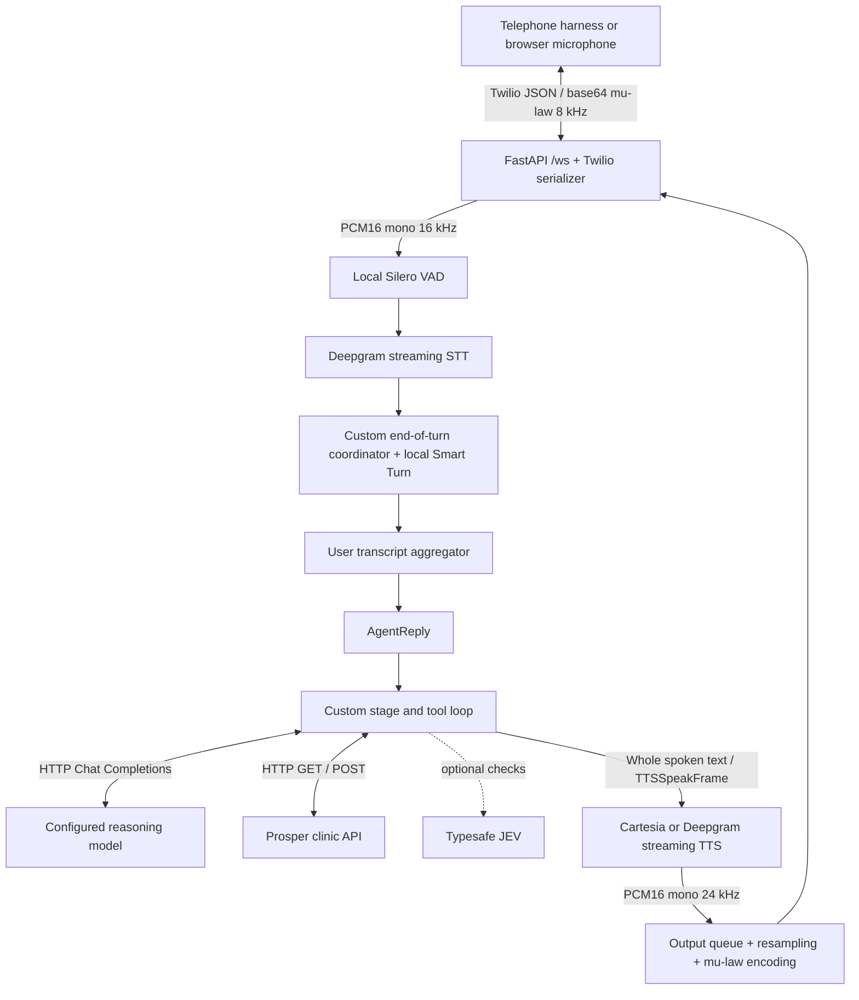
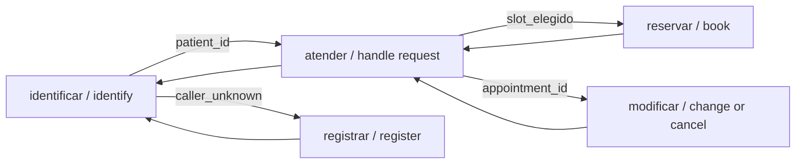

# Voice engine: STT → reasoning → tools → TTS

Inspected on 23 September 2026 at commit `33bf034f7cce8824984f9aec27ec341f7812ac85`.

This is a source and locked-dependency analysis. The Python environment was installed with `uv sync --frozen`; 111 targeted tests passed. No live provider call, clinic submission, deployment, or microphone session was performed. Model names below are the repository's configured identifiers, not a claim that every provider currently grants access to them. The deployment's actual environment is not in the clone.

## 1. What the engine is

The engine is a Python asyncio application using **Pipecat 1.11.0** to transport audio and control frames. FastAPI accepts Twilio-compatible WebSockets. Deepgram transcribes incoming audio; a custom Python agent calls an OpenAI-compatible LLM and clinic tools; Cartesia, or optionally Deepgram, synthesizes spoken replies.

It is a cascading voice pipeline. The reasoning model receives text and tool schemas, not audio. STT and TTS stream over WebSockets, but the live LLM client waits for complete HTTP responses. The application supplies its own tool loop instead of using Pipecat's OpenAI LLM processor. There is no OpenAI Realtime session, LangChain, LangGraph, or agent SDK in the live path.



The exact application processor order is in [src/agent/transcription.py:128](https://github.com/victorperdiguer/claudios-prosper-ai/blob/33bf034f7cce8824984f9aec27ec341f7812ac85/src/agent/transcription.py#L128). [src/twilio/transport.py:168](https://github.com/victorperdiguer/claudios-prosper-ai/blob/33bf034f7cce8824984f9aec27ec341f7812ac85/src/twilio/transport.py#L168) wraps it with transport input/output, operator takeover, an audio metrics tap, and optional recording.

## 2. Libraries and models

Versions below are resolved in [uv.lock](https://github.com/victorperdiguer/claudios-prosper-ai/blob/33bf034f7cce8824984f9aec27ec341f7812ac85/uv.lock); the broad minimum versions in [pyproject.toml](https://github.com/victorperdiguer/claudios-prosper-ai/blob/33bf034f7cce8824984f9aec27ec341f7812ac85/pyproject.toml) are not the exact installed versions.

| Component | Implementation | Locked version / configured model |
| --- | --- | --- |
| Audio orchestration | `pipecat-ai` | 1.11.0 |
| Speech activity | `SileroVADAnalyzer`, bundled ONNX model | `silero_vad.onnx` |
| End-of-turn classifier | `LocalSmartTurnAnalyzerV3`, local ONNX Runtime | Bundled `smart-turn-v3.2-cpu.onnx` |
| ONNX execution | `onnxruntime` | 1.24.4 |
| STT | Pipecat `DeepgramSTTService` → `AsyncDeepgramClient` | `deepgram-sdk` 7.9.0; `nova-3-general` |
| LLM requests | Synchronous `OpenAI` client, offloaded to a thread | `openai` 3.16.1 |
| Default LLM route | Helmcode OpenAI-compatible endpoint | `deepseek-v4-flash` |
| Example OpenAI configuration | [.env.example](https://github.com/victorperdiguer/claudios-prosper-ai/blob/33bf034f7cce8824984f9aec27ec341f7812ac85/.env.example) | `gpt-5.6-luna`, reasoning `none` |
| Reported successful-run LLM | OpenRouter → Google AI Studio | `google/gemini-3.8-flash`, reasoning `low` |
| Default TTS | Pipecat `CartesiaTTSService` | `sonic-3.6`, configurable via `TTS_MODEL` |
| Alternative TTS | Pipecat `DeepgramTTSService` | `aura-2-arcas-en`; Spanish switch uses `aura-2-nestor-es` |
| Optional evaluator | Typesafe HTTP API | `jev-latest` |
| Server | FastAPI / Uvicorn | 0.141.1 / 0.53.0 |
| HTTP business requests | `httpx` | 0.28.1 |
| WebSocket plumbing | `websockets` | 17.1 |
| Schemas | Pydantic | 2.13.5 |
| Persistence | SQLAlchemy / aiosqlite | 2.0.54 / 0.22.1 |

Cartesia TTS and Deepgram TTS use Pipecat's direct WebSocket implementations. There is no separate Cartesia Python SDK in the lockfile. Deepgram **STT** does use the Deepgram Python SDK. The OpenAI package's name does not identify the actual model provider.

Source: [src/stt/deepgram.py](https://github.com/victorperdiguer/claudios-prosper-ai/blob/33bf034f7cce8824984f9aec27ec341f7812ac85/src/stt/deepgram.py), [src/tts/factory.py](https://github.com/victorperdiguer/claudios-prosper-ai/blob/33bf034f7cce8824984f9aec27ec341f7812ac85/src/tts/factory.py), [src/agent/llm.py](https://github.com/victorperdiguer/claudios-prosper-ai/blob/33bf034f7cce8824984f9aec27ec341f7812ac85/src/agent/llm.py), [uv.lock](https://github.com/victorperdiguer/claudios-prosper-ai/blob/33bf034f7cce8824984f9aec27ec341f7812ac85/uv.lock), and [src/agent/RUN_RESULTS.md:17](https://github.com/victorperdiguer/claudios-prosper-ai/blob/33bf034f7cce8824984f9aec27ec341f7812ac85/src/agent/RUN_RESULTS.md#L17). The Smart Turn asset name, VAD defaults, and WebSocket payload details were checked in the installed Pipecat 1.11.0 source.

## 3. Connection and audio lifecycle

1. `agent.server:app` creates the application with `create_transcription_agent()` and an initial greeting.
2. A client opens `/ws`. The server accepts it and waits for a Twilio `start` message. `callSid` is the authoritative call ID; `customParameters.call_id` is a fallback. Caller number is only a hint. The server records connection time in Europe/Madrid.
3. The call gets its own pipeline, STT/TTS objects, language state, and `CallGraph`. The graph configuration is loaded at call start, so builder changes do not replace the graph underneath an active call.
4. A fixed English greeting is queued directly as `TTSSpeakFrame`, without an LLM request: “Arenal Clinic, how can I help you?”
5. Incoming `media.payload` is base64-encoded 8 kHz mono mu-law. Pipecat decodes and resamples it to 16 kHz PCM16 for the pipeline.
6. TTS produces 24 kHz PCM16 mono. Output is paced in 20 ms chunks and converted back to 8 kHz mu-law for the caller. The final telephone channel remains narrowband even though synthesis happens at 24 kHz.
7. Twilio `stop` becomes `EndFrame`. A disconnected socket cancels the worker. Idle and outer call limits are 720 seconds. The agent separately receives a 600-second advisory budget for its prompt; these are different limits.

`auto_hang_up=False` disables Twilio REST hang-up. The repository's harness speaks the Twilio wire protocol without requiring a Twilio account. A production phone number and its TwiML/call-routing setup are not provisioned by this engine.

The browser demo ([src/frontend/src/useDemoCall.js](https://github.com/victorperdiguer/claudios-prosper-ai/blob/33bf034f7cce8824984f9aec27ec341f7812ac85/src/frontend/src/useDemoCall.js)) uses `getUserMedia`, Web Audio, and a regular WebSocket. It downsamples the microphone to 8 kHz, encodes mu-law, and emits the same Twilio messages. It is not using WebRTC or a browser voice-agent SDK. Browser echo cancellation and noise suppression are requested; the backend does not configure a separate denoising processor.

Sources: [src/twilio/handshake.py:20](https://github.com/victorperdiguer/claudios-prosper-ai/blob/33bf034f7cce8824984f9aec27ec341f7812ac85/src/twilio/handshake.py#L20), [src/twilio/transport.py:99](https://github.com/victorperdiguer/claudios-prosper-ai/blob/33bf034f7cce8824984f9aec27ec341f7812ac85/src/twilio/transport.py#L99), [src/twilio/transport.py:127](https://github.com/victorperdiguer/claudios-prosper-ai/blob/33bf034f7cce8824984f9aec27ec341f7812ac85/src/twilio/transport.py#L127), [src/twilio/serializer.py:19](https://github.com/victorperdiguer/claudios-prosper-ai/blob/33bf034f7cce8824984f9aec27ec341f7812ac85/src/twilio/serializer.py#L19).

## 4. STT and deciding when to answer

### Speech detection

Silero runs locally. Pipecat's defaults in the locked version are confidence 0.7, minimum volume 0.6, and approximately 0.2 seconds each to confirm speech start and stop. These are detector thresholds, not measured end-to-end latency guarantees.

### Deepgram connection

Pipecat uses `AsyncDeepgramClient.listen.v1.connect()` for a persistent WebSocket to `wss://api.deepgram.com/v1/listen`, authenticated with the API key. Binary audio messages contain raw linear16 audio rather than WAV files or base64 JSON. Relevant settings are:

```text
model=nova-3-general
language=multi
encoding=linear16
sample_rate=16000
channels=1
endpointing=1500
interim_results=true
numerals=true
punctuate=true
smart_format=false
keyterm=<repeated clinic, clinician, insurer, and location names>
```

Smart formatting is deliberately disabled because ambiguous numeric dates can corrupt the caller's intended date. Keyterms bias recognition toward domain vocabulary; they are not a custom trained STT model.

Interim results become `InterimTranscriptionFrame`; final segments become `TranscriptionFrame`. A final segment is not necessarily the end of the caller's whole turn. Deepgram distinguishes `is_final` from `speech_final`; see its [endpointing documentation](https://developers.deepgram.com/docs/understand-endpointing-interim-results).

**A significant SDK detail:** in this locked Pipecat version, a local VAD stop also sends Deepgram a `Finalize` control message. The service also sends keepalives. The engine can therefore obtain a final segment and finish a turn without always waiting for Deepgram's full 1.5-second endpointing threshold.

### The custom coordinator

`DeepgramEOTCoordinator` keeps up to eight seconds of recent audio and combines three signals:

- Local VAD: is the caller still speaking?
- Deepgram: is there recognized final text?
- Smart Turn: does the recent audio sound like a completed turn?

A `speech_final` result creates a candidate. A normal final segment can also create one when VAD has been active and is now quiet; a final segment received during speech is held as a candidate until VAD stops.

Recognized text reaches the aggregator immediately, with `frame.finalized=False`. Only the turn-ending decision is delayed. This prevents the aggregator's timeout from firing while useful text is withheld.

For a candidate:

1. Reject it if VAD says speech is ongoing.
2. Run local Smart Turn on the buffered audio. This does not call a remote LLM. The [Pipecat documentation](https://docs.pipecat.ai/api-reference/server/utilities/turn-detection/smart-turn-overview) explains its local audio classification.
3. If classification is COMPLETE with probability greater than 0.5, wait until the candidate is at least 0.7 seconds old.
4. Otherwise defer until the candidate is five seconds old.
5. New transcript text or renewed VAD speech cancels the pending candidate.
6. If still valid, emit `ProposedUserStoppedSpeakingFrame`. The custom stop strategy commits the user turn, and the aggregator emits `LLMContextFrame`.

Smart Turn cannot initiate an answer by itself: it needs a Deepgram candidate. The user aggregator has a separate six-second stop timeout and an empty-turn recovery phrase. Speculative context frames are explicitly ignored by `AgentReply`.

Consequently, do not describe the latency as a fixed `1500 + 700 ms`. Candidate timing depends on final transcripts, local VAD/Finalize, network timing, and Smart Turn; five-second deferrals can be cancelled and restarted.

Sources: [src/stt/deepgram.py:103](https://github.com/victorperdiguer/claudios-prosper-ai/blob/33bf034f7cce8824984f9aec27ec341f7812ac85/src/stt/deepgram.py#L103), [src/stt/deepgram.py:215](https://github.com/victorperdiguer/claudios-prosper-ai/blob/33bf034f7cce8824984f9aec27ec341f7812ac85/src/stt/deepgram.py#L215), [src/stt/deepgram.py:336](https://github.com/victorperdiguer/claudios-prosper-ai/blob/33bf034f7cce8824984f9aec27ec341f7812ac85/src/stt/deepgram.py#L336), [src/agent/transcription.py:57](https://github.com/victorperdiguer/claudios-prosper-ai/blob/33bf034f7cce8824984f9aec27ec341f7812ac85/src/agent/transcription.py#L57).

## 5. The reasoning loop

### Provider selection

[src/agent/llm.py:27](https://github.com/victorperdiguer/claudios-prosper-ai/blob/33bf034f7cce8824984f9aec27ec341f7812ac85/src/agent/llm.py#L27) resolves configuration in this order:

1. A nonempty `HELMCODE_API_KEY` wins. Default URL: `https://api.helmcode.com/v1`; default model: `deepseek-v4-flash`. `HELMCODE_BASE_URL` and `HELMCODE_MODEL` override these. This branch supplies no reasoning-effort setting.
2. Otherwise use `OPENAI_API_KEY`, `OPENAI_BASE_URL` (default `https://api.openai.com/v1`), and required `OPENAI_MODEL`. `OPENAI_REASONING_EFFORT` is optional.
3. If neither credential exists, the lazy client fails when a completion is attempted. This is configuration selection, not automatic provider failover.

When the base URL hostname is `openrouter.ai`, `OPENROUTER_PROVIDER` can add `provider.only` and `allow_fallbacks=false` to requests. The recorded successful runs used:

```dotenv
OPENAI_BASE_URL=https://openrouter.ai/api/v1
OPENAI_MODEL=google/gemini-3.8-flash
OPENAI_REASONING_EFFORT=low
OPENROUTER_PROVIDER=google-ai-studio
```

That historical configuration is documented in the repo; it is not evidence of the current deployment's settings. A nonempty Helmcode key would override it.

### A model request

The client calls `client.chat.completions.create(...)`: an authenticated HTTP POST to the selected base URL plus `/chat/completions`. A typical request is structurally:

```json
{
  "model": "<configured model>",
  "messages": [{"role": "user", "content": "<assembled prompt>"}],
  "max_completion_tokens": 4096,
  "reasoning_effort": "low",
  "tools": [{"type": "function", "function": {"name": "<allowed tool>", "parameters": {}}}],
  "tool_choice": "auto"
}
```

This is an illustrative payload; real tool definitions contain descriptions and full schemas. If reasoning effort is unset, the client sends `temperature=0.0` instead. Even the literal effort value `none` suppresses the temperature field. No `stream=true` is sent.

The “system prompt” is a label inside a **single user-role message**. It includes the graph's system instructions, reply language, database guardrails, staff instructions, Madrid date, current stage instructions, recorded facts, legal transitions, and conversation/tool history. The runtime does not send that history as native assistant/tool-role messages, nor replay native tool-call IDs. It renders the history as text in a freshly assembled prompt on every request.

Native function calling is still used for the model's output. The application parses each function name and JSON arguments, executes it itself, and puts the result into the next prompt.

### One caller turn can contain multiple model requests

`AgentReply` extracts the latest caller text, updates the call language, and iterates `run_agent_turn()`:

1. Increment the turn counter and append caller text to in-memory history and local storage.
2. Load current guardrails and staff instructions from SQLite.
3. Offer the current stage's business tools plus internal graph tools.
4. Await a full model response in `asyncio.to_thread` so the synchronous SDK does not block the asyncio event loop.
5. Validate proposed operations against runtime stage rules. Apply `record_facts`; plan a `go_to` transition; refuse disallowed operations.
6. Optionally run the Typesafe guardrail check described below.
7. Decide what, if anything, is safe to speak. Internal bookkeeping stays silent. Business operations can produce one fixed acknowledgement, never a premature success announcement.
8. Execute business tools sequentially in threads; store their results; then apply the planned transition.
9. Reassemble the prompt with updated facts/results/stage and call the model again, without waiting for another caller turn.
10. Stop when the model gives an answer with no tool calls, or after four action iterations. If the turn still needs a final spoken answer, make a separate structured-output request using the `AgentResponse` Pydantic schema.

The bound is **four tool-capable completions plus a possible fifth, tool-free final-answer completion**, excluding retries. `MAX_ACTION_STEPS` counts model iterations, not individual tool executions. One response can request several tools, which the application executes sequentially.

`SEND_IMMEDIATE_RESPONSES` defaults to `true` in code, but [.env.example](https://github.com/victorperdiguer/claudios-prosper-ai/blob/33bf034f7cce8824984f9aec27ec341f7812ac85/.env.example) sets it to `false`. With false, acknowledgements before tools are suppressed. With true, queued acknowledgement audio can play while subsequent tools/model calls proceed; this still is not LLM token streaming.

Sources: [src/agent/reply.py:41](https://github.com/victorperdiguer/claudios-prosper-ai/blob/33bf034f7cce8824984f9aec27ec341f7812ac85/src/agent/reply.py#L41), [src/agent/agent.py:473](https://github.com/victorperdiguer/claudios-prosper-ai/blob/33bf034f7cce8824984f9aec27ec341f7812ac85/src/agent/agent.py#L473), [src/agent/agent.py:633](https://github.com/victorperdiguer/claudios-prosper-ai/blob/33bf034f7cce8824984f9aec27ec341f7812ac85/src/agent/agent.py#L633), [src/agent/agent.py:934](https://github.com/victorperdiguer/claudios-prosper-ai/blob/33bf034f7cce8824984f9aec27ec341f7812ac85/src/agent/agent.py#L934), [src/agent/llm.py:223](https://github.com/victorperdiguer/claudios-prosper-ai/blob/33bf034f7cce8824984f9aec27ec341f7812ac85/src/agent/llm.py#L223), [src/agent/llm.py:372](https://github.com/victorperdiguer/claudios-prosper-ai/blob/33bf034f7cce8824984f9aec27ec341f7812ac85/src/agent/llm.py#L372).

## 6. Stage graph, memory, and tool constraints

`AGENT_GRAPH_PATH` selects the configuration, defaulting to [graphs/default.json](https://github.com/victorperdiguer/claudios-prosper-ai/blob/33bf034f7cce8824984f9aec27ec341f7812ac85/graphs/default.json). [graphs/clinic.json](https://github.com/victorperdiguer/claudios-prosper-ai/blob/33bf034f7cce8824984f9aec27ec341f7812ac85/graphs/clinic.json) is a separate older/simpler graph and is not selected by default.



Each node has a prompt, an allowed tool list, and optional facts to clear when entering it. Each edge lists fact keys required for transition. The model uses internal `record_facts` and `go_to` tools; those have no network API. A sole eligible fact-gated transition can also be applied automatically.

The runtime enforces tool availability, transition reachability, required fact-key presence, duplicate successful reads within a turn, repeated submissions, pending submissions, and uncertain write failures. It suppresses additional tools after final no-action or escalation outcomes. Successful writes do not all terminate the conversation: two requested cancellations can be legal.

The runtime checks **fact-key existence**, not whether a recorded fact is true. Patient identity, consent interpretation, and grounding of the chosen slot still depend substantially on the model following the prompts and on API validation. A fact such as `slot_elegido` is not independently verified proof of consent.

Conversation memory is the per-call `CallGraph.history` and `facts`. There is no vector database or RAG retrieval in the live voice path. The separate `retrieve_memory()` function returns an empty string. History is resent in growing text form, with repeated identical clinic catalogues deduplicated during rendering; there is no general history summarization or context-token cap. Events persist to SQLite, but the live graph is not restored into a resumed voice session here.

Sources: [src/agent/graph.py:18](https://github.com/victorperdiguer/claudios-prosper-ai/blob/33bf034f7cce8824984f9aec27ec341f7812ac85/src/agent/graph.py#L18), [src/agent/stage_runtime.py:74](https://github.com/victorperdiguer/claudios-prosper-ai/blob/33bf034f7cce8824984f9aec27ec341f7812ac85/src/agent/stage_runtime.py#L74), [src/agent/stage_runtime.py:124](https://github.com/victorperdiguer/claudios-prosper-ai/blob/33bf034f7cce8824984f9aec27ec341f7812ac85/src/agent/stage_runtime.py#L124), [src/agent/stage_runtime.py:261](https://github.com/victorperdiguer/claudios-prosper-ai/blob/33bf034f7cce8824984f9aec27ec341f7812ac85/src/agent/stage_runtime.py#L261).

## 7. External requests beyond STT / LLM / TTS

### Clinic tools

All routes below use `PLATFORM_API_BASE_URL`, whose example is `https://hackspain.getprosperapp.com`, with `X-Api-Key: <PLATFORM_API_KEY>`.

| Tool | Request |
| --- | --- |
| `get_clinic_catalogue` | GET `/api/v1/clinic` |
| `search_patients` | GET `/api/v1/directory` with provided identifiers |
| `get_patient_appointments` | GET `/api/v1/patients/{patient_id}/appointments?when=...` |
| `search_availability` | GET `/api/v1/availability` with dates and provider/specialty/site/patient/insurer filters |
| `register_patient` | POST `/api/v1/submit/register` |
| `book_appointment` | POST `/api/v1/submit/book` |
| `reschedule_appointment` | POST `/api/v1/submit/reschedule` |
| `cancel_appointment` | POST `/api/v1/submit/cancel` |
| `submit_no_action` | POST `/api/v1/submit/no-action` |
| `escalate_to_human` | POST `/api/v1/submit/escalate` |

`call_id` is injected by the Python wrapper, not supplied by the model. Pydantic models validate submission payloads. Tool JSON schemas are built from Python signatures, annotations, enums, and docstrings.

The HTTP client is shared across calls, has a ten-second request timeout, and limits concurrent requests to five. The clinic catalogue is cached process-wide. Availability is restricted to at most fourteen inclusive days; provider-language and time-of-day filters also receive local processing.

The challenge's EHR is read-only; submission routes record the action for the platform. These POSTs should not be confused with an implementation of a transactional EHR scheduling backend.

Nearest-site requests additionally call `https://www.cartociudad.es/geocoder/api/geocoder/candidates`, with caller address, Madrid filter, and a five-second timeout. Geocoding is cached; distances are calculated locally, and clinic availability is checked for eligible sites. This is conditional on `near_address`, not a request on every turn.

### Typesafe evaluation

With `TYPESAFE_API_KEY`, the live tool loop can POST to `https://api.typesafe.ai/v1/systemone`, with Bearer authentication, model `jev-latest`, the current caller/model text, guardrails, and evaluation questions. It runs when there are guardrails and the tool completion contains nonempty text. This check is awaited before speech/tool execution and uses a 15-second HTTP timeout.

A separate background worker scores conversations, and another estimates rolling patient satisfaction. Those workers accept `TYPESAFE_DEFAULT_MODEL`; the inline guardrail call does not pass that override and uses the function default. The final structured-answer path does not call the inline JEV check. Thus this is neither a mandatory check on every spoken utterance nor purely background analytics.

The builder also offers AI prompt improvement and graph review using the shared LLM client; those requests are outside normal audio turns.

Sources: [src/agent/tools.py:90](https://github.com/victorperdiguer/claudios-prosper-ai/blob/33bf034f7cce8824984f9aec27ec341f7812ac85/src/agent/tools.py#L90), [src/agent/clinic_api.py:37](https://github.com/victorperdiguer/claudios-prosper-ai/blob/33bf034f7cce8824984f9aec27ec341f7812ac85/src/agent/clinic_api.py#L37), [src/agent/nearest_site.py:44](https://github.com/victorperdiguer/claudios-prosper-ai/blob/33bf034f7cce8824984f9aec27ec341f7812ac85/src/agent/nearest_site.py#L44), [src/agent/agent.py:523](https://github.com/victorperdiguer/claudios-prosper-ai/blob/33bf034f7cce8824984f9aec27ec341f7812ac85/src/agent/agent.py#L523), [src/scoring/jev.py:77](https://github.com/victorperdiguer/claudios-prosper-ai/blob/33bf034f7cce8824984f9aec27ec341f7812ac85/src/scoring/jev.py#L77), [src/twilio/server.py:86](https://github.com/victorperdiguer/claudios-prosper-ai/blob/33bf034f7cce8824984f9aec27ec341f7812ac85/src/twilio/server.py#L86), [src/agent/graph_api.py:57](https://github.com/victorperdiguer/claudios-prosper-ai/blob/33bf034f7cce8824984f9aec27ec341f7812ac85/src/agent/graph_api.py#L57).

## 8. Speech output

Before synthesis, spoken dates are reformatted for English or Spanish. A local speech guard rejects some internal prompt/tool-name leaks and replies longer than 100 words or 800 characters. These checks are deterministic regex/length checks, not another generative model.

`AgentReply._speak()` emits a dashboard event plus `TTSRequestedFrame` and `TTSSpeakFrame`. The TTS provider receives spoken text, not the LLM's complete reasoning context or clinic tool schemas.

### Cartesia, the default

Pipecat connects to `wss://api.cartesia.ai/tts/websocket` with `X-API-Key` and, in the locked version, `Cartesia-Version: 2026-03-01`. The adapter builds requests containing:

```json
{
  "model_id": "sonic-3.6",
  "transcript": "Your spoken reply.",
  "voice": {"mode": "id", "id": "<TTS_VOICE>"},
  "language": "en",
  "context_id": "<audio-context-id>",
  "continue": true,
  "output_format": {"container": "raw", "encoding": "pcm_s16le", "sample_rate": 24000},
  "add_timestamps": true,
  "use_normalized_timestamps": false
}
```

The adapter closes input with the corresponding continuation/finalization message. Cartesia returns base64 audio chunks, timestamps, completion, or error messages. The adapter decodes chunks and tracks them by context. Cancellation sends `{"context_id":"...","cancel":true}`. The current [Cartesia WebSocket reference](https://docs.cartesia.ai/api-reference/tts/websocket) describes these message types; payload syntax above comes from the locked SDK rather than assuming current docs match its API version.

### Deepgram alternative

The connection is `wss://api.deepgram.com/v1/speak?model=<voice>&encoding=linear16&sample_rate=24000`, using `Authorization: Token <key>`. The service sends JSON `Speak` messages with text, then `Flush`; audio returns as binary PCM. Interruption sends `Clear`. The application selects this service only when `TTS_PROVIDER=deepgram`; there is no automatic fallback from Cartesia to Deepgram.

### Language behavior

The call starts in English. A local word/phrase heuristic selects English, Spanish, or Catalan from complete caller text, including explicit language-change requests. Names and short identifiers usually preserve the previous language. This is not a separate language-detection API, and the application does not simply use Deepgram's detected-language field.

Cartesia updates its language setting while retaining the configured voice. Catalan text is mapped to its Spanish setting. Deepgram switches voices for English/Spanish; an unsupported mapping leaves the voice unchanged. The repo documents Catalan recognition/pronunciation limitations. `TTS_LANGUAGE` configures initial Cartesia synthesis, not the fixed greeting text or the call-language state's default.

Sources: [src/agent/speech.py:36](https://github.com/victorperdiguer/claudios-prosper-ai/blob/33bf034f7cce8824984f9aec27ec341f7812ac85/src/agent/speech.py#L36), [src/agent/reply.py:93](https://github.com/victorperdiguer/claudios-prosper-ai/blob/33bf034f7cce8824984f9aec27ec341f7812ac85/src/agent/reply.py#L93), [src/tts/factory.py:28](https://github.com/victorperdiguer/claudios-prosper-ai/blob/33bf034f7cce8824984f9aec27ec341f7812ac85/src/tts/factory.py#L28), [src/agent/language.py:216](https://github.com/victorperdiguer/claudios-prosper-ai/blob/33bf034f7cce8824984f9aec27ec341f7812ac85/src/agent/language.py#L216).

## 9. Interruption and cancellation

Default Pipecat start strategies use VAD or transcription to identify a new user turn. The aggregator broadcasts interruption frames both upstream and downstream. Pipecat cancels interruptible processor work and resets queues, which interrupts `AgentReply` and the TTS audio context. Cartesia receives a context cancellation; Deepgram TTS receives Clear; the Twilio serializer emits a wire-level `clear`.

The browser demo honours `clear` and stops scheduled playback. Real Twilio clears its playback buffer. The challenge harness is documented as ignoring `clear`, so dropping unsent local audio is essential and already-sent audio cannot be recalled there.

Two important qualifications:

- Cancelling an await on `asyncio.to_thread` does not terminate the synchronous HTTP request inside that thread. An interrupted LLM request can continue remotely, consuming time/tokens even though the response will not be spoken.
- Submissions are deliberately shielded. `_finish_submission()` waits for an in-flight POST's outcome to be recorded, then re-raises cancellation. State prevents a second submission while the first is pending and blocks further submissions after an uncertain write failure. This avoids treating interruption as proof that a booking did not happen; it is not a server-enforced idempotency mechanism.

The application records an entire utterance in `CallGraph.history` before playback completes. It does not wire an assistant playback-aware aggregator back into that history. An interrupted utterance can therefore remain represented as fully said even when the caller heard only part of it.

Human takeover is a separate operator WebSocket at `/api/calls/{call_id}/operator`. It diverts caller audio away from STT to the operator, injects operator audio into output, and mutes agent audio. The model's `escalate_to_human` tool only records an escalation request; it does not open that live bridge itself.

Sources: [src/agent/agent.py:774](https://github.com/victorperdiguer/claudios-prosper-ai/blob/33bf034f7cce8824984f9aec27ec341f7812ac85/src/agent/agent.py#L774), [src/agent/agent.py:824](https://github.com/victorperdiguer/claudios-prosper-ai/blob/33bf034f7cce8824984f9aec27ec341f7812ac85/src/agent/agent.py#L824), [src/agent/stage_runtime.py:124](https://github.com/victorperdiguer/claudios-prosper-ai/blob/33bf034f7cce8824984f9aec27ec341f7812ac85/src/agent/stage_runtime.py#L124), [src/twilio/takeover.py:35](https://github.com/victorperdiguer/claudios-prosper-ai/blob/33bf034f7cce8824984f9aec27ec341f7812ac85/src/twilio/takeover.py#L35), [src/agent/operator.py:33](https://github.com/victorperdiguer/claudios-prosper-ai/blob/33bf034f7cce8824984f9aec27ec341f7812ac85/src/agent/operator.py#L33), plus locked Pipecat frame-processor/aggregator implementations.

## 10. A concrete turn

Suppose the caller is already identified and says, “Yes, book that appointment.” An illustrative sequence is:

1. Incoming audio streams continuously to Deepgram.
2. VAD stops; Pipecat requests Deepgram Finalize; a final transcript becomes an end-of-turn candidate.
3. Smart Turn accepts it and the coordinator commits after its grace window.
4. `AgentReply` invokes `run_agent_turn` with the text.
5. LLM request 1 sees the current `atender` stage, offered slot, caller confirmation, and tools. It can call `record_facts` for `slot_elegido` and `go_to` for `reservar`.
6. The runtime validates/applies that transition. Nothing is spoken for these bookkeeping operations.
7. LLM request 2 sees `reservar` and calls `book_appointment` with the grounded identifiers/slot.
8. An optional acknowledgement is queued. Python validates the arguments, injects `call_id`, and POSTs `/api/v1/submit/book`.
9. LLM request 3 sees the tool result and writes a concise confirmation. Speech formatting runs; the text is sent to TTS.
10. TTS chunks begin returning and are played while the microphone remains active. Renewed caller speech can interrupt playback.

This is one possible trace, not a captured live call. A caller turn can need fewer or more iterations depending on the stage, facts, and model's choices.

## 11. Latency, observability, and limits found

The approximate response path is:

```text
last caller speech
  → final transcript / end-of-turn gate
  → full LLM response
  → optional inline guardrail HTTP request
  → tools and additional full LLM responses as needed
  → TTS first audio
  → transport playback
```

Main performance implications from the implementation:

- LLM output is not streamed, so TTS cannot start on the first generated sentence/token.
- A short caller reply can trigger several sequential model round trips just to record facts, transition stages, invoke a tool, and formulate an answer.
- The incomplete-turn path deliberately waits longer to avoid talking over the caller.
- Inline Typesafe checks can add another network hop. The fixed refusal on this branch is English even if the call has switched language.
- Prompts grow with call history and full tool results. Only identical catalogue repetition is compressed.
- LLM timeout is not customized: the locked SDK defaults to 600 seconds, with two SDK retries. The application separately retries malformed response JSON twice. The four-step loop is not a strict wall-clock deadline.
- The 600-second prompt budget does not stop the loop; the outer transport timeout is 720 seconds. Older comments about three-minute challenge limits are not the current enforcement constants.
- The Dockerfile does not copy [uv.lock](https://github.com/victorperdiguer/claudios-prosper-ai/blob/33bf034f7cce8824984f9aec27ec341f7812ac85/uv.lock) before `uv sync`; deployed dependency versions can differ from this locally locked analysis.

The implementation records `stt_partial`, `stt_final`, `llm_call` (model, duration, tokens, prompt characters, available metadata), tool calls/results, facts, stages, speech text, and whole-turn duration. `calls.db` holds console events; the SQLAlchemy database holds agent events/guardrails/staff instructions.

With `CALL_RECORDINGS_DIR`, it additionally writes per-call WAV tracks, metadata, and `timeline.jsonl`, including VAD, endpoint candidates/cancellations, LLM/tool timing, and interruptions. The top-level time-to-first-audio metric includes the fixed greeting, so it does not measure the typical caller-turn response delay. Use per-turn timeline events to separate endpointing, model, tools, and TTS latency.

These are source-backed observations, not a measured latency benchmark or a complete security audit. The API/consent/guardrail boundaries would need separate hardening work before being treated as a production clinical system.

## 12. Reading and verification map

Read these in order:

| File | What it answers |
| --- | --- |
| [src/agent/transcription.py](https://github.com/victorperdiguer/claudios-prosper-ai/blob/33bf034f7cce8824984f9aec27ec341f7812ac85/src/agent/transcription.py) | How are the live processors connected? |
| [src/twilio/transport.py](https://github.com/victorperdiguer/claudios-prosper-ai/blob/33bf034f7cce8824984f9aec27ec341f7812ac85/src/twilio/transport.py) | Who owns the call, audio rates, greeting, and teardown? |
| [src/stt/deepgram.py](https://github.com/victorperdiguer/claudios-prosper-ai/blob/33bf034f7cce8824984f9aec27ec341f7812ac85/src/stt/deepgram.py) | Exactly when is a turn complete? |
| [src/agent/reply.py](https://github.com/victorperdiguer/claudios-prosper-ai/blob/33bf034f7cce8824984f9aec27ec341f7812ac85/src/agent/reply.py) | How does a completed transcript start reasoning and speech? |
| [src/agent/agent.py](https://github.com/victorperdiguer/claudios-prosper-ai/blob/33bf034f7cce8824984f9aec27ec341f7812ac85/src/agent/agent.py) | How do model calls, tools, final answers, and cancellation interact? |
| [src/agent/llm.py](https://github.com/victorperdiguer/claudios-prosper-ai/blob/33bf034f7cce8824984f9aec27ec341f7812ac85/src/agent/llm.py) | Which endpoint/model gets called, with what payload? |
| [src/agent/stage_runtime.py](https://github.com/victorperdiguer/claudios-prosper-ai/blob/33bf034f7cce8824984f9aec27ec341f7812ac85/src/agent/stage_runtime.py) and [graphs/default.json](https://github.com/victorperdiguer/claudios-prosper-ai/blob/33bf034f7cce8824984f9aec27ec341f7812ac85/graphs/default.json) | What state and rules constrain the model? |
| [src/agent/tools.py](https://github.com/victorperdiguer/claudios-prosper-ai/blob/33bf034f7cce8824984f9aec27ec341f7812ac85/src/agent/tools.py) and [src/agent/clinic_api.py](https://github.com/victorperdiguer/claudios-prosper-ai/blob/33bf034f7cce8824984f9aec27ec341f7812ac85/src/agent/clinic_api.py) | Which operations call external APIs? |
| [src/tts/factory.py](https://github.com/victorperdiguer/claudios-prosper-ai/blob/33bf034f7cce8824984f9aec27ec341f7812ac85/src/tts/factory.py) | Which speech provider/model/voice is selected? |
| [src/twilio/recording.py](https://github.com/victorperdiguer/claudios-prosper-ai/blob/33bf034f7cce8824984f9aec27ec341f7812ac85/src/twilio/recording.py) | How can the loop be observed and timed? |

Validation command executed:

```sh
uv run --frozen pytest -q \
  tests/test_deepgram_endpointing.py tests/test_transcription_agent.py \
  tests/test_agent_reply.py tests/test_stage_graph.py tests/test_llm_tools.py \
  tests/test_tts_factory.py tests/test_twilio_serializer.py \
  tests/test_call_latency_events.py tests/test_call_language.py
```

Result: **111 passed**, with three dependency deprecation warnings. No application code was changed. TypeScript checking is not applicable to this Python/documentation investigation, and no frontend build was run.

Graphify indexed 117 code files into 1,459 nodes and 3,475 edges for navigation. The graph is code-only; graph JSON configuration files produced no AST nodes and were read directly. Source inspection, not graph inference, is the evidence for the behavior described here.
